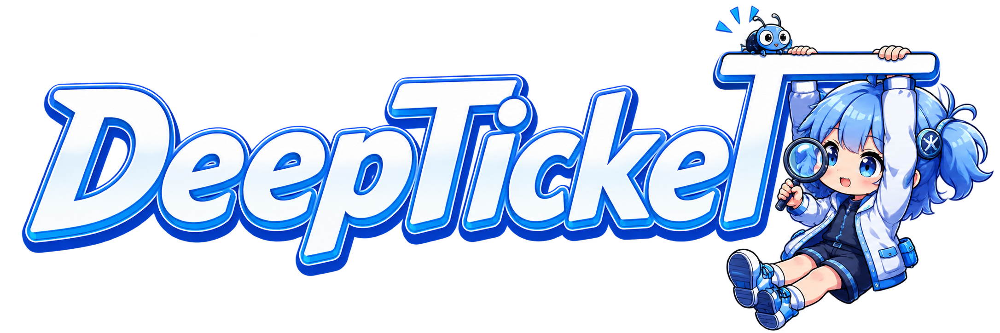
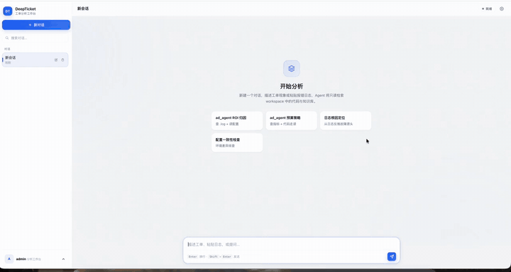
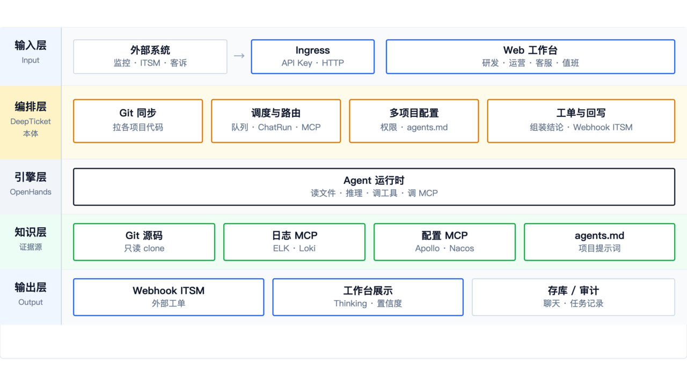

  

  <a href="README.md">中文</a>
  ·
  <a href="CHANGELOG.en.md">Changelog</a>
  ·
  <a href="https://github.com/shanananana/deepticket/releases/tag/v0.3.1">v0.3.1</a>
  ·
  <a href="LICENSE">MIT</a>

  
  
  
  

<h3 align="center">Self-hosted Agent orchestration for business teams</h3>

<strong>Let frontline staff find evidence before escalating to engineering</strong>

Runs on OpenHands · Git / logs / config / MCP · tickets &amp; alerts · not a company Copilot replacement

  <a href="#overview"><strong>Overview</strong></a>
  ·
  <a href="#features"><strong>Features</strong></a>
  ·
  <a href="#use-cases"><strong>Use cases</strong></a>
  ·
  <a href="#quick-start"><strong>Quick start</strong></a>
  ·
  <a href="#docs"><strong>Docs</strong></a>

---

## Overview

DeepTicket is a **team-owned Agent orchestration layer**: Git knowledge, internal logs and config, MCP tools, and ticket/alert hooks in one workbench, with multi-turn investigation on OpenHands.

The goal is not “chat more”—it is **evidence before close or escalate**: source paths, log lines, config keys—not just retrieved doc chunks. Engineering keeps Copilot; business teams usually pilot with Docker on their own infra.

---

## Features

<h3>Connect</h3>

<ul>
<li><strong>Multi-project</strong> — sidebar switch; per-project repos, MCP, agents.md</li>
<li><strong>Ingress</strong> — tickets/alerts over HTTP, async analysis in the background</li>
<li><strong>Per-project MCP</strong> — config lookup, release history, internal docs—scoped per team</li>
</ul>

<h3>Investigate</h3>

<ul>
<li><strong>Git sync</strong> — code in workspace; the agent can read source</li>
<li><strong>Logs / config</strong> — Skill templates or MCP wired to your platforms</li>
<li><strong>Evidence in replies</strong> — paths, snippets, keys; agents.md enforces read-only and cite-first</li>
</ul>

<h3>Deliver</h3>

<ul>
<li><strong>Webhook write-back</strong> — conclusions to ticket/ITSM; target is per-project</li>
<li><strong>Human in the loop</strong> — close if it checks out; escalate with context if not</li>
<li><strong>yaml + sidebar</strong> — versioned config or runtime edits</li>
</ul>

---

## Highlight

<h3>Evidence first, not empty chat</h3>

DeepTicket pushes the agent to search the workspace before concluding—not generic advice. Project <code>agents.md</code> sets read-only rules, paths, and “say when unsure.”

<blockquote>

Frontline needs “can I close this?” Engineering needs “escalation with context.” DeepTicket sits in between.

</blockquote>

---

## vs pure RAG / company Copilot

Pick your category: ingested Q&amp;A, company-wide Copilot, or a team-owned layer that hooks internal systems and writes back to tickets.

| | Pure RAG | Platform Copilot | DeepTicket |
|--|:--:|:--:|:--:|
| Read Git source | Chunks | Limited | ✅ |
| Internal logs / config | Ingest | Coarse | ✅ MCP / Skills |
| Ticket / alert write-back | ❌ | Weak | ✅ Ingress |
| Team self-host | Varies | Wait on platform | ✅ Docker / yaml |

<strong>vs OpenHands:</strong> OpenHands runs the agent engine; DeepTicket is the workbench, Git sync, and ticket ingress.

---

## Use cases

<h3>Product, ops, QA</h3>

Wire logs and config, add a few MCP tools, give accounts to non-engineers. Typical questions: bug or not? matches spec? prod vs doc?

Replies cite log lines, config keys, and code paths—close yourself or ping engineering with context.

<h3>Reports and metrics</h3>

With a reporting/BI MCP, ask cross-sheet questions (e.g. campaign ROI vs daily report). Let the machine run joins first; you decide what to trust.

Vertical example: <a href="https://github.com/shanananana/ad_agent">ad_agent</a> (ad ROI). DeepTicket is the wiring and multi-project shell.

<h3>Tickets and alerts</h3>

HTTP from your ticket or alert system, async analysis, conclusion out via Webhook. On-call reads the draft, then escalates or not.

---

## Demo

  

---

## Quick start

Open <strong>http://127.0.0.1:8600</strong> · default <code>admin / admin</code> · set LLM in sidebar <strong>LLM settings</strong>

<table>
<tr>
<td width="50%" valign="top">

<strong>🐳 Docker (remote image, recommended)</strong>

<pre><code>mkdir deepticket &amp;&amp; cd deepticket
curl -LO https://raw.githubusercontent.com/shanananana/deepticket/main/docker-compose.image.yml
curl -LO https://raw.githubusercontent.com/shanananana/deepticket/main/.env.docker.example
cp .env.docker.example .env
docker compose -f docker-compose.image.yml up -d
</code></pre>

<code>ghcr.io/shanananana/deepticket:v0.3.1</code> · see <a href="docs/docker.md">docs/docker.md</a>

</td>
<td width="50%" valign="top">

<strong>📦 Clone (development)</strong>

<pre><code>git clone https://github.com/shanananana/deepticket.git
cd deepticket
bash scripts/setup.sh
bash scripts/start_all.sh
</code></pre>

Try the Nginx log in <a href="docs/DEMO_PROMPT.md">DEMO_PROMPT.md</a> · ROI demo <a href="docs/quickstart-demo.md">quickstart-demo</a>

</td>
</tr>
</table>

Stop: <code>docker compose down</code> · Logs: <code>docker compose logs -f deepticket</code> · Verify: <code>bash scripts/verify.sh</code>

---

## Architecture

  

---

## Docs

| Doc | Description |
|-----|-------------|
| [docs/docker.md](docs/docker.md) | Docker deploy, GHCR image, persisted config |
| [docs/DEMO_PROMPT.md](docs/DEMO_PROMPT.md) | Copy-paste sample prompts (Nginx logs, etc.) |
| [docs/quickstart-demo.md](docs/quickstart-demo.md) | Recorded demo and ROI walkthrough |
| [deepticket.example.yaml](deepticket.example.yaml) | Config template (copy to deepticket.yaml) |
| [CONTRIBUTING.md](CONTRIBUTING.md) | Local dev, tests, contributing |
| [CHANGELOG.en.md](CHANGELOG.en.md) | Release notes |

Multi-project, MCP, Ingress, and agents.md: sidebar in the workbench or admin API <code>/api/admin/projects/{id}</code>

---

## FAQ

<strong>Minimum setup?</strong> LLM key; Git repos optional; log/config MCP when needed.

<strong>vs company Copilot?</strong> Coexists—usually a small team-owned deploy.

<strong>Stage?</strong> Alpha (v0.3.1)—Stars and Issues welcome.

Local dev: <code>pip install -e ".[dev]"</code> · <code>pytest -q</code> · <code>bash scripts/verify.sh --online</code>

---

⭐ <a href="https://github.com/shanananana/deepticket">Star</a> if useful · <a href="LICENSE">MIT</a>

