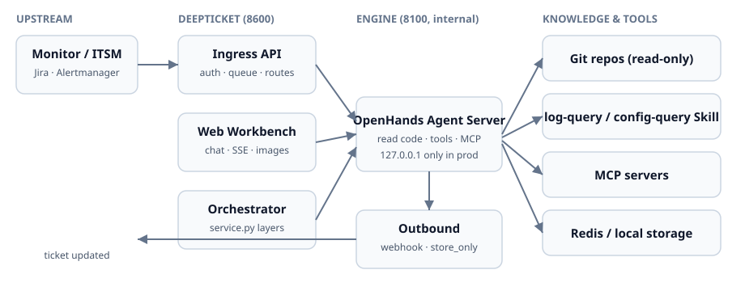

<p align="center">
  <a href="README.md">中文</a>
  ·
  <a href="CHANGELOG.en.md">Changelog</a>
  ·
  <a href="https://github.com/shanananana/deepticket/releases">Releases</a>
  ·
  <a href="https://github.com/shanananana/deepticket/stargazers">GitHub Stars</a>
  ·
  <a href="https://github.com/OpenHands/OpenHands">OpenHands</a>
  ·
  <a href="LICENSE">MIT</a>
</p>

<p align="center">
  
  
  
  
  
</p>

**A self-hosted SRE Agent orchestration layer for business teams** ([latest v0.1.2](https://github.com/shanananana/deepticket/releases/tag/v0.1.2)) — **does not replace** company-wide AIOps / Copilot platforms. It plugs into your existing **MCP servers, logs, config center, and ITSM** on [OpenHands](https://github.com/OpenHands/OpenHands) with Ingress/Webhook loops so agents triage on **Git source + logs + config** with auditable reasoning, Thinking steps, and **analysis confidence**.

Keywords: AIOps · SRE · on-call · enterprise · business team · self-hosted · MCP integration · orchestration · incident triage · root cause analysis · LLM agent · FastAPI

- **Thin orchestration layer** — Self-hosted deployment, yaml wiring; **coexists** with monitoring / ITSM / config—no fight for the “platform agent” slot
- **MCP / Skill extensions** — Mount internal MCP (logs, config, CMDB…) that platform agents rarely expose at this granularity
- **Ingress / Outbound** — Alerts and tickets in; analysis back via Webhook
- **Workbench** — Multi-turn chat, Thinking steps, confidence; SSE heartbeat for proxies
- **Example** — Vertical agent: [ad_agent](https://github.com/shanananana/ad_agent); DeepTicket **wires infra + runs the SRE pipeline**

<p align="center">
  <a href="docs/quickstart-demo.md"><strong>5-minute quick start</strong></a>
  ·
  <a href="docs/DEMO_PROMPT.md">Sample prompts</a>
  ·
  <a href="https://github.com/shanananana/ad_agent">ad_agent demo</a>
</p>

---

## Demo

<p align="center">
  <a href="docs/assets/demo.mp4">
    
  </a>
</p>

<p align="center"><sub>Click the GIF for the full MP4 (~67s) · GitHub does not render <code>&lt;video&gt;</code> in README</sub></p>

---

## 5-minute quick start

```bash
git clone https://github.com/shanananana/deepticket.git
cd deepticket
bash scripts/setup.sh
# Edit deepticket.yaml — set llm.api_key
bash scripts/start_all.sh
bash scripts/quickstart_demo.sh
```

Open http://127.0.0.1:8600 — default `admin` / `admin`. Paste the **Nginx log** sample from [docs/DEMO_PROMPT.md](docs/DEMO_PROMPT.md) (no Git repo required).

Full ROI demo (logs + code): [docs/quickstart-demo.md](docs/quickstart-demo.md).

---

## Why DeepTicket

Three common failure modes in incident triage and project Q&A:

1. **Chat-only / RAG-only** — Retrieves doc chunks but struggles with call chains, live logs, and runtime config; answers sound plausible but are hard to verify.  
2. **Traditional ticket AI** — Good at summaries and routing, rarely reads **real Git repos** or wires into internal log/config systems.  
3. **Raw OpenHands** — Powerful Agent runtime, but no Ingress/Webhook, routing, knowledge sync, or single-file ops config for ITSM loops.

DeepTicket is a **team-level thin orchestration layer** on OpenHands: ingress, webhook outbound, Git knowledge, and Skill/MCP extensions so the Agent grounds answers in **source + (optional) logs + (optional) config**.

> **Note:** Alpha stage. Set an **LLM API key** and mount **one or more Git repos** in `knowledge.repos` to run code-level triage; log/config MCP and Skills are **optional extensions**, not required day one.

---

## Why it fits enterprise business teams

Company-wide agents (Copilot portals, unified AI platforms) optimize for **breadth**: docs, chat, generic coding help. DeepTicket is intentionally **narrow and deep** for on-call—**read source → query logs → check config → write back to tickets** in one verifiable flow.

Mature orgs already have rich infra. DeepTicket **does not fight it**:

| What you already have | What DeepTicket does |
|-----------------------|----------------------|
| Log platform (ELK / Loki / internal) | Query via `log-query` Skill or **MCP**—no new index |
| Config center / Apollo / Nacos | Pull runtime config via Skill or **MCP** |
| ITSM / Jira / internal tickets | **Ingress in, Webhook out**—same workflow |
| Internal MCP servers (CMDB, deploy, monitoring…) | Mount in `deepticket.yaml`; agent calls on demand |
| Company AIOps / Copilot platform | **Coexist**—self-hosted team layer, no platform roadmap dependency |

**Typical rollout:** a business team clones DeepTicket → fills `deepticket.yaml` (LLM key + **multiple team Git repos**) → mounts internal MCP / Skills **as needed** → on-call uses the workbench; monitoring/tickets flow through Ingress. Data stays in the team—**no waiting on company-wide agent platform scheduling**.

Vertical agents like [ad_agent](https://github.com/shanananana/ad_agent) handle domain chat; DeepTicket **wires infra and runs the SRE pipeline**—they compose, not compete.

---

## Comparison

| Capability | Pure RAG | Platform-wide agent | Traditional ticket AI | **DeepTicket** |
|------------|:--------:|:---------------------:|:-----------------------:|:--------------:|
| Positioning | Doc chunks | Company Copilot, broad & shallow | Summarize / route | **Team SRE orchestration, narrow & deep** |
| Read real Git / call chains | Stale chunks | Limited / generic chat | Usually no | ✅ Read-only clone + Agent |
| Production logs / config | Manual ingest | Rarely internal MCP granularity | Limited | ✅ Skill / **MCP** (your existing services) |
| Coexist with ITSM / monitoring | ❌ | Often tied to one platform | Partial | ✅ Ingress + Webhook, **incremental wiring** |
| Team self-host / pilot | Medium | Wait for platform roadmap | SaaS-first | ✅ Self-host + yaml, multiple repos, **no platform slot fight** |
| Auto-trigger from alerts/tickets | ❌ | Weak | Partial | ✅ Ingress + async queue |
| Engineer chat + confidence | Chat | Yes | Weak | ✅ Workbench + SSE + confidence |
| Out-of-the-box | Low (embeddings / vector DB / ingest) | High (SaaS) | Higher (SaaS) | ✅ LLM key + Git repos; log/config MCP optional |

---

## Who uses it

| Scenario | Status |
|----------|--------|
| Author’s team internal pilot | 🟢 Ticket triage, project Q&A, Ingress integration tests |
| Public production stories | 🟡 None yet — share yours in [Issues](https://github.com/shanananana/deepticket/issues) (anonymous OK) |

---

## Architecture

<p align="center">
  
</p>

<p align="center"><sub>Users and upstream systems only hit <strong>8600</strong>; bind Agent Server <strong>8100</strong> to <code>127.0.0.1</code> in production</sub></p>

---

## Quick Start

See [5-minute quick start](#5-minute-quick-start) above. Common commands:

| Command | Purpose |
|---------|---------|
| `bash scripts/start_all.sh` | Daily startup |
| `bash scripts/quickstart_demo.sh` | Onboarding hints / optional ROI logs |
| `bash scripts/status.sh` | Health & queue check |
| `bash scripts/verify.sh` | Offline/online self-check |

Use **8600** in the browser only; **8100** is internal—bind to `127.0.0.1` in production.

---

## Configuration

Everything lives in **`deepticket.yaml`** (copy from `deepticket.example.yaml`; gitignored). Main sections:

| Section | Purpose |
|---------|---------|
| `llm` | Model and API key |
| `knowledge.repos` | Read-only Git repos |
| `ingress` | External tickets/alerts in, Webhook out |
| `storage` | Local or Redis |
| `web` | Workbench SSE heartbeat interval (`sse_heartbeat_seconds`) |
| `extensions` / `mcp` | Skills and MCP |

Wire logs/config via `log-query` / `config-query` Skill templates or MCP. See **`deepticket.example.yaml`** for field comments.

---

## Usage

**Web workbench** — Log in → new chat → describe the issue or paste logs → sync knowledge when needed → iterate. Enable **record mode** in settings to keep Agent steps expanded for demos. **Confidence** badges appear on analysis runs with verification steps (hidden for casual chat). Set **`web.sse_heartbeat_seconds`** in `deepticket.yaml` when deploying behind idle-timeout proxies.

**Automation** — Push events from monitoring/ITSM; DeepTicket analyzes asynchronously and callbacks via Webhook or store-only. Usually yaml only, no core code changes. Local test: `bash scripts/test_ingress_e2e.sh`.

---

## Development

```bash
pip install -e ".[dev]"
pytest -q
bash scripts/verify.sh --online
```

**Requirements:** macOS / Linux · Python 3.11+ · OpenAI-compatible LLM · Redis optional

---

## FAQ

<details>
<summary><strong>Is this for enterprise / business-team intranet? Will it conflict with company AIOps?</strong></summary>
<p>DeepTicket is a <strong>thin orchestration layer</strong>, not another platform agent meant to replace company tools. It chains your existing logs, config, ITSM, and internal <strong>MCP</strong> services into one triage flow via Ingress/Webhook and Skills—<strong>no new monitoring stack, no Copilot roadmap dependency</strong>. Ideal for a self-hosted team pilot: yaml config, data stays in the team. Platform agents go broad; DeepTicket goes deep on on-call—source, logs, config, ticket write-back.</p>
</details>

<details>
<summary><strong>How is DeepTicket related to OpenHands?</strong></summary>
<p>OpenHands runs the agent (files, terminal, MCP). DeepTicket adds multi-user workbench, Git knowledge sync, Ingress tickets, Webhook outbound, and routing for SRE/on-call workflows.</p>
</details>

<details>
<summary><strong>How is this different from RAG or Spring AI agents like ad_agent?</strong></summary>
<p>RAG retrieves doc chunks; vertical agents like <a href="https://github.com/shanananana/ad_agent">ad_agent</a> focus on one business domain. DeepTicket targets <strong>Git + logs + config + ITSM loops</strong> for verifiable incident triage.</p>
</details>

<details>
<summary><strong>Can I integrate Jira or monitoring alerts?</strong></summary>
<p>Yes — HTTP POST to Ingress with API key; results via Webhook. See <code>deepticket.example.yaml</code> and <code>bash scripts/test_ingress_e2e.sh</code>.</p>
</details>

---

## Contributing

Stars, issues, and PRs welcome. First time? Read **[CONTRIBUTING.md](CONTRIBUTING.md)** and look for **`good first issue`**.

---

<p align="center">⭐ If this project helps you, please consider giving it a <a href="https://github.com/shanananana/deepticket">Star</a>!</p>

---

## License

[MIT](LICENSE)
